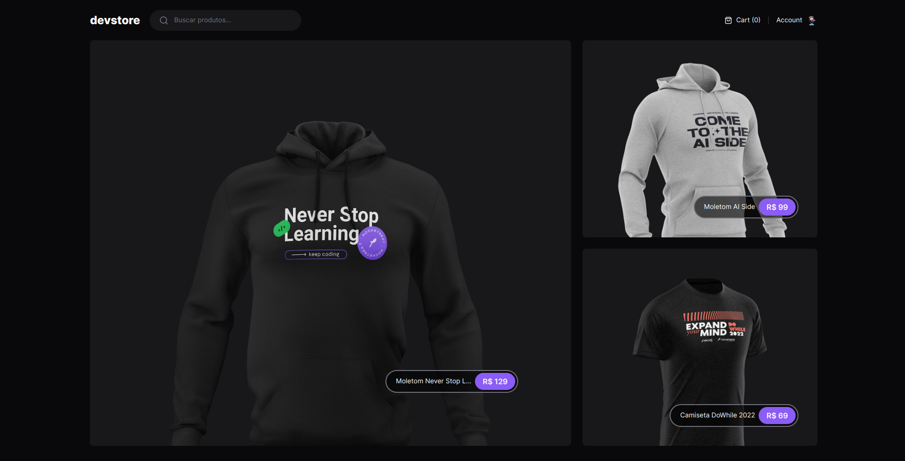
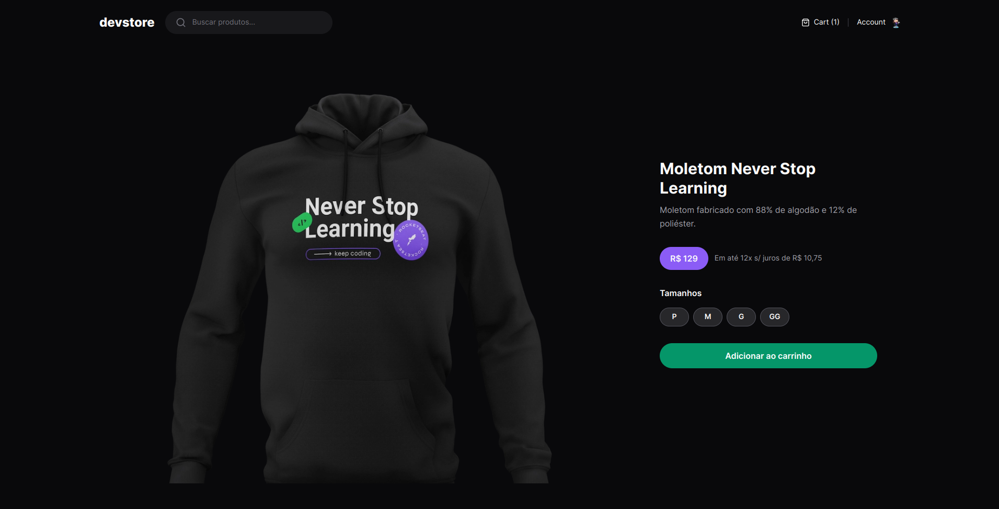
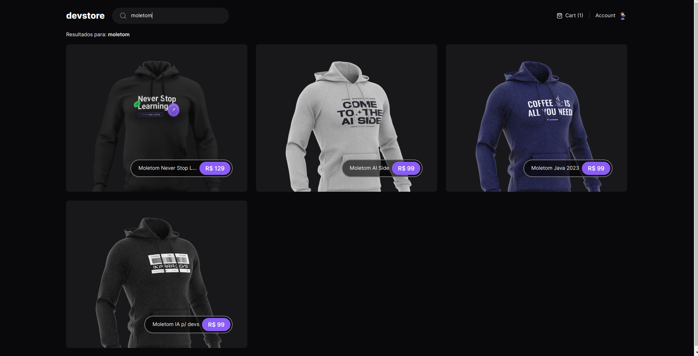

  <a href="#-tecnologias">Tecnologias</a>&nbsp;&nbsp;&nbsp;|&nbsp;&nbsp;&nbsp;
  <a href="#-projeto">Projeto</a>&nbsp;&nbsp;&nbsp;|&nbsp;&nbsp;&nbsp;
  <a href="#-como-rodar">Como rodar</a>&nbsp;&nbsp;&nbsp;|&nbsp;&nbsp;&nbsp;
  <a href="#-como-contribuir">Como contribuir</a>&nbsp;&nbsp;&nbsp;
  

 

  

# Dev Store

## 🚀 Tecnologias

Esse projeto foi desenvolvido com as seguintes tecnologias:

- [Pnpm](https://pnpm.io/) - 8.10.5
- [Nextjs](https://nextjs.org/) - 14.0.3
- [React](https://react.dev/) - 18
- [Tailwind-merge](https://www.npmjs.com/package/tailwind-merge) - 2.0.0
- [Lucide-react](https://lucide.dev/guide/packages/lucide-react) - 0.292.0
- [Zod](https://zod.dev/) - 3.22.4

## 💻 Projeto

Neste módulo aprendemos sobre o Next.js, um framework famoso do ecossistema React. Criamos um projeto utilizando o Next.js, que consiste em funcionalidades básicas como listagem de produtos, carrinho, busca e criamos um modal para exibir os detalhes do produto quando o usuário clica em um item. Também exploramos a estrutura de pastas e arquivos gerados, com foco na busca e exibição de dados de uma API. Além disso, fizemos uso do Cypress, que é uma ferramenta open source muito popular para testes end-to-end para simular os fluxos comuns de um e-commerce. Os testes end-to-end garantem que o comportamento da aplicação se mantenha conforme novas features são adicionadas.

- Módulo Next.js App Router e Testes do Ignite na plataforma da [Rocketseat](https://www.rocketseat.com.br/).

  

  

## ⚙️ Como Rodar

- Clone o projeto.
- Entre na pasta do projeto e rode 'npm install' (use 'yarn install' se for essa a sua configuração).
- npm run dev (para rodar o projeto na porta indicada).

## 🤔 Como contribuir

- Faça um fork desse repositório;
- Cria uma branch com a sua feature: `git checkout -b minha-feature`;
- Faça commit das suas alterações: `git commit -m 'feat: Minha nova feature'`;
- Faça push para a sua branch: `git push origin minha-feature`.

Depois que o merge da sua pull request for feito, você pode deletar a sua branch.

## 📝 Licença

Esse projeto está sob a licença MIT.
